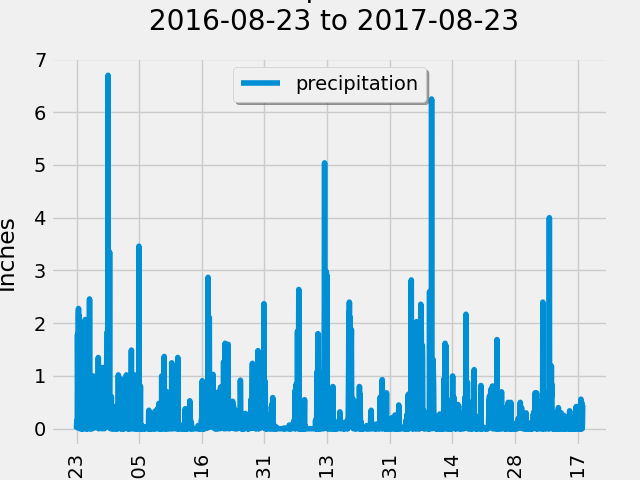
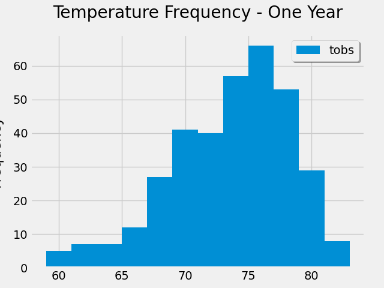

# sqlalchemy-challenge
Repo for bootcamp module 10 - SQLAlchemy challenge

Vincent Passanisi

Due Date: December 28, 2022
Submitted January 1, 2023

# **Introduction**

This challenge requires a climate analysis for a Hawaiian vacation, using Python and SQLAlchemy. The analysis is comprised of a precipitation analysis for the most recent 12 months of data in the dataset, and a temperature analysis of the station with the greatest number of observations. The precipitation analysis is plotted visually on a bar graph and the temperature analysis is represented with a histogram.

# **Files**

In the folder *SurfsUp* are the completed challenge files.

* *climate_starter_final.ipynb* - my jupyter notebook with my SQLAlchemy analysis and matplotlib graphs.
* *app_complete.py* - My python script with my Flask API.
* *Resources* folder with the data .csv files and sqlite engine
* *Output* folder with image files

# **Results**

The precipitation analysis shows the rainfall for all stations for the last year of data starting on 8/23/16. First exploratory analysis was conducted to see the available data from the provided .csv files. One file had the infomration for each station. The second file contained all the mearurement data, including rainfall and temperature. A dataframe was created with the data for all stations and the results plotted on a bar graph.

A statistical analysis was also done of the dataframe and yielded the following results.

	prcp
count	2021.000000
mean	0.177279
std	0.461190
min	0.000000
25%	0.000000
50%	0.020000
75%	0.130000
max	6.700000

The temperature analysis was conducted on the most active station in terms of observations. That station was WAIHEE 837.5, HI US which had 2,772 observations in the dataset. 

The average temperature as well as the high and low for the period were examined. For WAIHEE the low was 54.0 F, the high 85.0 F.,and the average temperature was 71.66 F. The frequency of observations was plotted on a histogram, shown below.

Finally, a python script was written to create an API using the Flask framework.

    Welcome to the Climate App API!

    Vincent Passanisi
    December 2022 - UCI Data Analytics Bootcamp

    Here are the Available Routes:

    For a JSON of the precipitation analysis, use this route:

    /api/v1.0/precipitation

    For a JSON list of stations in the dataset, use this route:

    /api/v1.0/stations

    For a JSON list of temperature observations for the previous year for the most active station, use this route:

    /api/v1.0/tobs

    For a JSON list of the minimum temperature, the average temperature, and the maximum temperature,for a specified start date for each station,
    append a start date to the route in the format yyyy-mm-dd

    /api/v1.0/

    For a JSON list of the minimum temperature, the average temperature, and the maximum temperature for a specified date range,
    append a start and end date in the format yyyy-mm-dd/yyyy-mm-dd

    /api/v1.0//

# **Comments and Thoughts**